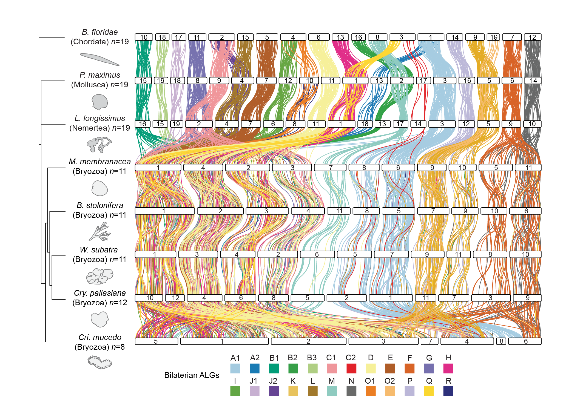
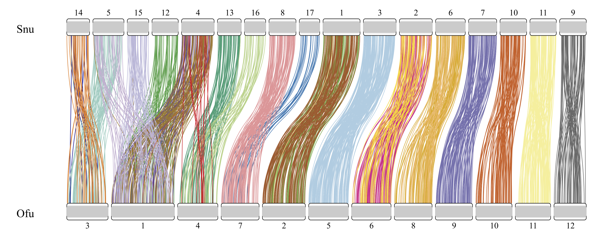

## 1. Description 
This repository contains a series of scripts which can be used to perform and visualise macrosynteny analysis on chromosome level genomes of metazoan species. 


```SyntenyFinder.py``` is a python script to run on command line. Given a list of NCBI genome assembly accessions, the script downloads the associated annotated genomes, runs OrthoFinder, and automatically generates the karyotype and coordinate files necessary to run synteny analysis in RIdeogram. 
For genomes without a published annotation on NCBI, the folder ```SyntenyFinder_customisable``` contains ```Synteny_main.ipynb```, which is a fully customisable script which can intake a wide range of annotation formats. 
```plot_ideogram.R``` takes the generated files and creates macrosynteny plots. 

<figure>
 
 </figcaption><b>Figure 1: </b> </figcaption> Evolution of genome structure in bryozoans (Lewin, et al. 2024). Figure created using svg files generated by the SyntenyFinder pipeline and pieced together using Adobe Illustrator. 
</figure>


File tree for SyntenyFinder: 
```
SyntenyFinder

├── SyntenyFinder.py
├── dependencies
│   └── Synteny_functions.py
├── plot_ideogram
│   └── plot_ideogram.R
└── SyntenyFinder_customisable
    ├── Synteny_main.ipynb
    ├── Example.ipynb
    ├── dependencies
    │   └── Synteny_functions.ipynb
    ├── input_data (*)
    │   ├── gene_rows
    │   │   └── ...
    │   ├── genomes
    │   │   └── ...
    │   └── proteomes
    │       └── ...
    └── synteny_v5.5.R
```
Items marked with a ```(*)``` are not provided in this repository. 


## 2. Files in this repository 

* ```SyntenyFinder.py``` is a python script which downloads genome assemblies from NCBI, runs OrthoFinder, and generates the karyotype and coordinate files necessary for macrosynteny analysis. 
* ```dependencies``` contains the files needed to run ```SyntenyFinder.py```
    * ```Synteny_functions.py``` contains the required helper functions. 
* ```plot_ideogram``` provides the file tree necessary to visualise the macrosynteny using RIdeogram
    * The karyotype and coordinate output files from ```SyntenyFinder``` should be copied into the ```input``` folder.
    * ```plot_ideogram.R``` generates the plots and saves the resulting svg and pdf files in ```ideograms/svg``` and ```ideograms/pdf``` respectively. 
* ```SyntenyFinder_customisable``` contains the code and data used to generate the figures for our research article and is customisable, allowing for different sources of intake files. This folder works independently and could be omitted from, or used instead of, the rest of the repository. 
    * ```Synteny_main.ipynb``` generates karyotype and coordinate files in a more customisable manner, allowing for a wider variety of intake files.
    * ```synteny_v5.5.R``` generates Oxford dot plots and RIdeogram macrosynteny plots, and additionally analysed mixing rates. 

## 3. Dependencies 
#### Bash: 
```SyntenyFinder.py``` relies on [```OrthoFinder```](https://davidemms.github.io) to identify single-copy orthologous genes. Please first make sure OrthoFinder and all necessary dependencies are [correctly installed](https://davidemms.github.io/orthofinder_tutorials/downloading-and-running-orthofinder.html). 

Additionally, ```SyntenyFinder.py``` uses [NCBI's command line tools](https://www.ncbi.nlm.nih.gov/datasets/docs/v2/download-and-install/) [```datasets```](https://www.ncbi.nlm.nih.gov/datasets/docs/v2/reference-docs/command-line/datasets/) and [```dataformat```](https://www.ncbi.nlm.nih.gov/datasets/docs/v2/reference-docs/command-line/dataformat/) to download the requested accessions and pull assembly information such as species and number of chromosomes. Please ensure these are installed and running correctly. 

#### Python: 
The majority of packages used by SyntenyFinder are part of the [Python Standard Library](https://docs.python.org/3/library/index.html); namely ```subprocess```, ```os```, ```re```, ```zipfile```, ```argparse```, ```concurrent.futures```, and ```io```. These should be available by default. 

Additionally, [```Pandas```](https://pandas.pydata.org/getting_started.html) and [```Biopython```](https://biopython.org/wiki/Download) are required. These can be installed with the following commands: 

```pip install pandas``` 

```pip install biopython``` 

## 4. Usage 
### Documentation 
Use the following command: 
```python /path/to/SyntenyFinder.py --help```

### Quick start 
To generate karyotype and coordinate files, run the following command in ```/SyntenyFinder```: 

```
python SyntenyFinder.py --accessions GCA_914767715.1,GCF_902652985.1 --run_name get_synteny
```
This command downloads the GenBank annotated genome assembly [GCA_914767715.1](https://www.ncbi.nlm.nih.gov/datasets/genome/GCF_001039355.2/) for the Bryozoan species *Membranipora membranacea* and the RefSeq annotated genome assembly [GCF_902652985.1](https://www.ncbi.nlm.nih.gov/datasets/genome/GCF_902652985.1/) for the scallop *Pecten maximus*. It runs OrthoFinder and finds single-copy orthologues, then generates karyotype and coordinate files. The folder ```get_synteny``` is created within the working directory  ```/SyntenyFinder``` to store output, as well as intermediate run files. 


### Full command: 

```
python /path/to/SyntenyFinder.py \
--accessions accession1,accession2,accession3 \
--run_name run_name1 \
--algs first \
--orthofinder path/to/orthofinder \
--threads 20 \
--directory path/to/root/folder
```

#### Flags 
* Required: 
    * ```--accessions``` : Comma separated list of accessions for annotated chromosome level genomes on NCBI. 

    * ```--run_name``` : Name of run iteration used to create a directory 
* Optional: 

    * ```--algs``` : Code or accession of species used in run to trace ancestral linkage groups. 

    * ```--directory``` : Root directory for analysis folder to be created. (Default: ```./```)

    * ```--orthofinder``` : Path to executable OrthoFinder, if not installed. If any errors are encountered using this flag, please ensure the bin containing OrthoFinder is in the path. 

    * ```--threads``` : Number of threads to use when running OrthoFinder 

### Output: 
Running ```SyntenyFinder.py``` results in the generation of the following tree of files: 
```
directory (root directory provided) 
├── ncbi_downloads
│   ├── <Sp1>
│   │   └── ncbi_dataset
│   │       └── data
│   │           └── accession1
│   ├── <Sp2>
│   │   └── ncbi_dataset
│   │       └── data
│   │           └── accession2
│   └── ...
└── run_name
    ├── output
    │   ├── Sp1_coordinates.tsv
    │   ├── Sp1_karyotype.txt
    │   ├── Sp2_coordinates.tsv
    │   ├── Sp2_karyotype.txt
    │   ├── Sp3_coordinates.tsv
    │   ├── Sp3_karyotype.txt
    │   └── ...
    └── run_files
        ├── orthofinder_output
        │   └── Results_MmmDD
        │       ├── ...
        │       ├── Orthogroups
        │       └── ...
        └── run_proteomes
```
The files ```XXX_coordinates.tsv``` and ```XXX_karyotype.txt``` are the intake files necessary for running RIdeogram to generate a macrosynteny figure. Copy them to ```plot_ideogram/input``` and generate the plots using ```plot_ideogram.R```. 

### Notes: 
* An ncbi_downloads folder is created in the provided root ```directory```, rather than in the ```run_name``` folder. This improves efficiency, as it prevents the same accession from being downloaded multiple times across different run folders. 
* Species codes are defined by the first letter of an organism's genus name followed by the first two letters of its species name. In runs where multiple species share the same code, codes are defined by the first two letters of an organism's genus name followed by the first three letters of its species name. **Unexpected issues may arise if multiple species share the same species code within the same directory provided.**

## 5. Plotting in R

The script ```SyntenyFinder/plot_ideogram/plot_ideogram.R``` takes the karyotype and coordinate files generated by SyntenyFinder and plots them using [RIdeogram](https://github.com/TickingClock1992/RIdeogram?tab=readme-ov-file). 

<figure>
  
 </figcaption><b>Figure 2: </b> </figcaption> Raw figure generated using SyntenyFinder pipeline
</figure>

To use this script, first copy the output files from ```root_directory/run_name/output``` to ```plot_ideogram/input```. Then create the directories indicated with an ```(*)``` as shown below for the output files of ```plot_ideogram.R```. 
```
SyntenyFinder
└── plot_ideogram
    ├── ideograms (*)
    │   ├── pdf (*)
    │   └── svg (*)
    ├── input (*)
    │   └── <copy output from SyntenyFinder>
    └── plot_ideogram.R
```
This script generates SVG and PDF files which can then be modified in illustrator to create the final figures. 

## 6. Additional information

### Citation
Please cite our preprint if you use this pipeline: 

[T. D. Lewin, I. J.-Y. Liao, M.-E. Chen, J. D. D. Bishop, P. W. H. Holland, Y.-J. Luo, ​​Fusion, Fission, and Scrambling of the Bilaterian Genome in Bryozoa. bioRxiv, 2024.02.15.580425 (2024).](https://doi.org/10.1101/2024.02.15.580425)

